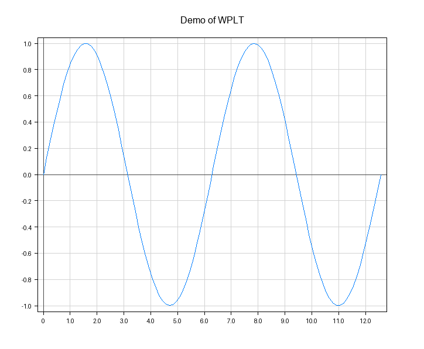

<br />
<div align="center">
  <a href="https://github.com/Neobyte01/WPLT">
    
  </a>
  <h3 align="center">WPLT</h3>
  <p align="center">Plotting with Python: Straight-forward data visualization</p>
</div>

## About The Project

WPLT is an open-source plotting library built in and for Python. Using WPLT you can plot data into figures, preview them and save them into files, with multiple options for adding a cartesian plane, labeled legend, and more. It closely imitates the popular Python library Matplotlib, but includes functionality to animate data with time-based variables. This library was built and developed for educational purposes, and is therefore not meant as a serious contender to other popular options. and developed for educational purposes.

## Getting Started

- [Installation](https://github.com/Neobyte01/WPLT/wiki/Installation)
- [Quickstart](https://github.com/Neobyte01/WPLT/wiki/Quickstart)
- [API reference](https://github.com/Neobyte01/WPLT/wiki/API)

## Showcase

A simle demo of what you can do with WPLT in a few lines of code.

<div align="left">
  
</div>

```python
import wplt
import numpy as np

c = wplt.TimeSeries(0, 2*np.pi)
X = np.linspace(0, 4*np.pi, 100)
Y = wplt.TimeSeries.apply(np.sin, c+X)

wplt.plot(X, Y)
wplt.xaxis()
wplt.yaxis()
wplt.grid()
wplt.save()
```

## License

Distributed under the MIT License. See [license](https://github.com/Neobyte01/WPLT/blob/main/LICENSE) for more information.
